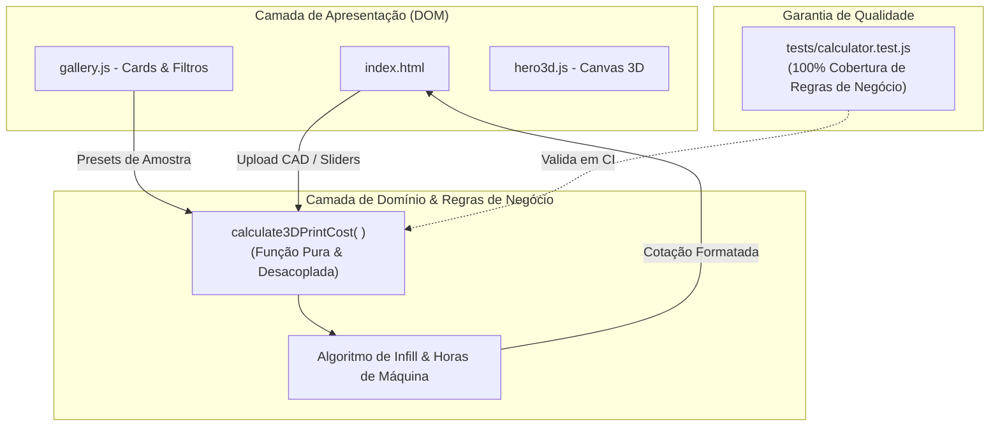

<div align="center">

# ⚡ SOLID MESH STUDIO 3D
### *Hub de Fabricação Digital, Prototipagem Avançada & Manufatura 4.0*

[](https://github.com/zecarn/Solid-Mesh/actions/workflows/deploy.yml)
[](LICENSE)
[](https://developer.mozilla.org/en-US/docs/Web/JavaScript/Guide/Modules)
[](https://nodejs.org/api/test.html)
[](https://tailwindcss.com)
[](https://zecarn.github.io/Solid-Mesh/)

<br/>

👉 **[🌐 ACESSE A APLICAÇÃO ONLINE (LIVE DEMO)](https://zecarn.github.io/Solid-Mesh/)** 👈

<br/>

---

</div>

## 📌 Visão Geral do Projeto

O **Solid Mesh Studio 3D** é uma plataforma web moderna de manufatura aditiva sob demanda e engenharia reversa. O projeto foi arquitetado com foco em **alta performance**, **experiência imersiva (Cyberpunk/Industrial Dark)** e **rigor de engenharia de software**, oferecendo ferramentas interativas em tempo real como cálculo instantâneo de fatiamento 3D e visualizador vetorial tridimensional.

---

## ✨ Principais Funcionalidades

- 🕹️ **Viewport 3D Vetorial Interativo:** Renderizador de geometria 3D construído do zero em **HTML5 Canvas**, com controles de órbita 360° (mouse e touch), rotação contínua, zoom com amortecimento e troca dinâmica de materiais.
- 🧮 **Motor de Cotação em Tempo Real (*Instant Quote Engine*):** Algoritmo de fatiamento estimado que calcula horas de máquina, peso efetivo com multiplicadores de preenchimento (*infill* 10% a 100%), taxas por grama de polímeros/resinas e aplicação de economia de escala.
- 📂 **CAD Dropzone com Análise de Arquivos:** Interface de arraste de modelos `.STL`, `.OBJ`, `.3MF` e `.STEP` com barra de progresso simulada e validação de geometria.
- 🗂️ **Galeria Dinâmica de Modelos:** Repositório técnico com filtros por categorias (Peças Técnicas, Protótipos, Decoração, Colecionáveis) e injeção automática de parâmetros na calculadora.
- 📑 **Formulário de Consultoria Técnica:** Interface para submissão de projetos personalizados e demandas de engenharia reversa.

---

## 🏛️ Arquitetura de Software & Design Patterns

O projeto adota os princípios de **Clean Architecture** e **Separação de Responsabilidades (SoC)**, mantendo a base de código modular, legível e altamente testável:

```
Solid-Mesh/
├── .github/workflows/
│   └── deploy.yml              # Pipeline automatizada de CI/CD (Lint, Tests, Deploy)
├── css/
│   ├── theme.css               # Design tokens, variáveis CSS (:root) e scrollbar customizada
│   └── styles.css              # Animações chave (laser scanner, cyber grid matrix)
├── js/
│   ├── main.js                 # Entry point da aplicação (Bootstrap de módulos)
│   └── modules/
│       ├── hero3d.js           # Renderizador Canvas 3D e controles de órbita
│       ├── calculator.js       # Regras de negócio puras e motor de cálculo de custos
│       ├── gallery.js          # Gerenciamento de abas e integração da galeria
│       ├── contact.js          # Validação e submissão do formulário técnico
│       └── navbar.js           # Comportamento dinâmico de scroll da barra de navegação
├── tests/
│   └── calculator.test.js      # Suíte de testes unitários automatizados (Node.js Native)
├── assets/                     # Recursos gráficos e imagens
├── index.html                  # Esqueleto semântico da aplicação
├── serve.ps1                   # Servidor de desenvolvimento local nativo em .NET/PowerShell
├── package.json                # Metadados e scripts de execução de testes
└── LICENSE                     # Licença MIT
```

### 🔁 Fluxo de Dados e Comunicação Modular



---

## 🧪 Testes Automatizados (Node.js Native Runner)

O projeto conta com suíte de testes unitários automatizados utilizando o **Node.js Native Test Runner (`node:test` e `node:assert/strict`)**, garantindo zero dependências externas para testes.

### 📋 Cenários Testados:
1. **Cálculo Padrão:** Validação do preço final e tempo de máquina para 85g PLA Silk @ 20% infill.
2. **Piso Mínimo (*Price Floor*):** Garantia de que peças minúsculas respeitem o piso mínimo operacional (R$ 35,00).
3. **Escalonamento de Infill:** Validação do multiplicador de consumo de filamento a 100% de densidade (peças maciças).
4. **Economia de Escala em Lotes:** Validação de diluição da taxa fixa de calibração para produção em série ($Q > 1$).
5. **Diferenciação de Materiais:** Impacto proporcional das taxas da Resina 8K vs. PLA/PETG/ABS.
6. **Defesa contra Edge Cases:** Tratamento robusto contra entradas numéricas negativas, zero ou nulas.

### Como executar os testes:

```bash
npm test
```
*Saída esperada:*
```text
▶ 3D Printing Cost Calculator Engine
  ✔ should calculate baseline cost correctly for 85g PLA Silk at 20% infill
  ✔ should enforce minimum order price floor (R$ 35,00) for tiny parts
  ✔ should scale material and machine time when infill is 100% (Solid part)
  ✔ should calculate batch production with economies of scale (diluting fixed setup fee)
  ✔ should apply higher rates for high-precision resin 8K correctly
  ✔ should handle edge cases and invalid input defensively
✔ 3D Printing Cost Calculator Engine (100% passing)
```

---

## 🚀 Pipeline de CI/CD (GitHub Actions)

A cada `git push` na branch `main` ou abertura de *Pull Request*, a esteira automatizada executa:

1. **Job `lint-and-validate` (CI):**
   - Checagem de integridade estrutural de arquivos.
   - Validação sintática estática de todos os arquivos JavaScript (`node --check`).
   - Execução automática da suíte de testes unitários (`npm test`).
2. **Job `deploy` (CD):**
   - Configuração de credenciais seguras OIDC.
   - Empacotamento de artefatos estáticos.
   - Publicação atômica e com zero downtime no **GitHub Pages**.

---

## 💻 Como Rodar o Projeto Localmente

### Opção 1: Usando o Servidor Nativo (Sem precisar instalar nada)
```powershell
.\serve.ps1
```
*O script em .NET/PowerShell iniciará o servidor e abrirá o navegador automaticamente em `http://localhost:8080`.*

### Opção 2: Usando Node.js
```bash
npm run serve
# ou
npx serve .
```

---

## 🛠️ Tecnologias & Ferramentas

- **Linguagens:** HTML5 Semântico, CSS3 Moderno, JavaScript (ES6+ Modules).
- **Engine 3D:** HTML5 Canvas 2D Context com Projeção Vetorial Perspectiva 3D.
- **Estilização:** Tailwind CSS v3, Glassmorphism, Neon Glow Utilities, Google Fonts (Orbitron, Space Grotesk, Inter).
- **Testes:** Node.js Native Test Runner (`node:test`, `node:assert`).
- **DevOps / CI/CD:** GitHub Actions, GitHub Pages, OIDC Authentication.

---

## 📄 Licença

Distribuído sob a licença **MIT**. Consulte o arquivo [LICENSE](LICENSE) para obter mais informações.

---

<div align="center">

Desenvolvido com ⚡ por **[Zeca](https://github.com/zecarn)** • Solid Mesh Studio

</div>
